<picture>
  <source media="(prefers-color-scheme: dark)" srcset="./assets/banner-dark.svg">
  <source media="(prefers-color-scheme: light)" srcset="./assets/banner-light.svg">
  
</picture>

---

### What I'm building

I build **agentic AI systems that survive contact with production** — graph-orchestrated
LLM pipelines with guardrails, gateways, evals and tracing, not notebook demos. Most of my
work lands somewhere in **healthcare AI**: clinical trials, consultation notes, prescriptions.

**Enterprise Agentic RAG** — four Cloud Run microservices (api, ui, evals, ingestion).
A LangGraph state machine routes *Planner → Retriever → Grade Docs → Rewriter / Web Search →
Context Guard → Responder → Output Guard*, fronted by NeMo Guardrails and a Portkey gateway
with Llama 3.3 70B → 3.1 8B fallback. Qdrant + FlashRank reranking, Redis semantic cache,
RAGAS evals, Postgres-backed LangGraph checkpointing, Eventarc-triggered ingestion,
Logfire + LangSmith traces.

**Clinical Trial Matcher** — matches patients to ClinicalTrials.gov studies through LLM
clinical reasoning. Five-node LangGraph pipeline, PubMedBERT embeddings, Qdrant, and a real
eval suite with ground truth and synthetic patients rather than vibes.

**AI Clinical Scribe** — consultation audio → structured clinical documentation. Whisper STT,
spaCy entity extraction, FastAPI backend, React + TypeScript front end.

**MedGuide AI** — handwritten prescription analysis via Grok-4 vision, with a real
handwritten-prescription dataset and an evals folder.

### How I work

- **Evals before claims.** If I say a system works, there's a scored suite behind it. One of
  my own project reviews notes a classifier's 99% accuracy is mostly one feature doing the
  work — I'd rather write that down than quietly ship the number.
- **Guardrails by default.** Prompt-injection defense, output sanitisation and PII redaction
  show up in my projects even when nobody asked for them.
- **Infra is part of the model.** Docker, Terraform, Cloud Run, CI, and tracing are how a
  pipeline becomes a system.

### Currently

Deepening **multi-agent orchestration** and **MCP**, and pushing the Enterprise RAG stack from
a monolith into properly separated services. Open to collaborating on **agentic AI** and
**clinical/health-tech ML**.

---

### Stats

<!-- Setup instructions for these cards live in SETUP.md, deliberately NOT here.
     This file renders on a public profile; a walkthrough for forking a repo and
     deploying to Vercel does not belong on the page people actually read. -->

  

<!-- Stats + top-langs cards. Commented out until a self-hosted
     github-readme-stats instance exists: the public instance returns 503 /
     "API rate limit exceeded", which renders as a broken image.

     TO ENABLE: see SETUP.md section 3, replace YOUR-INSTANCE below with your
     Vercel domain, then delete the two comment markers around this block.

     hide_rank=true is intentional and should stay -- the rank badge is
     stars-weighted, so on a newer account it grades social reach rather than
     engineering. -->

<!--

  
  

-->

### Contribution graph

<picture>
  <source media="(prefers-color-scheme: dark)"
          srcset="https://raw.githubusercontent.com/Akashkar00/Akashkar00/output/snake-dark.svg">
  <source media="(prefers-color-scheme: light)"
          srcset="https://raw.githubusercontent.com/Akashkar00/Akashkar00/output/snake-light.svg">
  
</picture>

<!-- These resolve only after the "Generate Snake" workflow has run green once:
     the `output` branch does not exist until then. -->

### Find me

<!--
  ============================================================================
  SOCIAL BADGES — READ BEFORE EDITING
  ============================================================================

  Palette: bg 0A101F  |  cyan 22D3EE  |  emerald 10B981  |  violet A78BFA
  All badges use style=for-the-badge and background 0A101F.
  Separator between badges is &nbsp;&nbsp; (do not use plain spaces —
  GitHub collapses them and the badges end up touching).

  ---------------------------------------------------------------------------
  THE LINKEDIN QUIRK — DO NOT "SIMPLIFY" THE LINKEDIN BADGE
  ---------------------------------------------------------------------------
  shields.io's built-in `logo=linkedin` only renders its glyph when the badge
  background is LinkedIn brand blue (0A66C2). On ANY custom background colour
  the glyph is silently dropped — no error, no warning, HTTP 200 — and you get
  a text-only badge that looks "fine" until you notice the icon is missing.

  Measured (2026-07-27):
    https://img.shields.io/badge/LinkedIn-0A101F?style=for-the-badge
      -> 200, 445 bytes                         (text-only baseline)
    https://img.shields.io/badge/LinkedIn-0A101F?style=for-the-badge&logo=linkedin
      -> 200, 445 bytes, no <image> element     (BUG: byte-identical to
                                                 text-only, glyph vanished)
    the data-URI version used below
      -> 200, 1312 bytes, contains <image ... data:image/svg+xml;base64,...>
                                                (glyph actually present)

  THE FIX (already applied below): the LinkedIn glyph is embedded directly in
  the `logo=` query parameter as a URL-encoded base64 SVG data-URI. The SVG
  path comes from simple-icons and is hard-filled #FFFFFF so it reads against
  the dark 0A101F badge. Because the fill is baked into the data-URI,
  `logoColor=` has NO effect on this badge — to recolour the glyph you must
  rebuild the data-URI, not add a query param.

  TO REGENERATE (e.g. if simple-icons updates the mark):
    1. curl -sL https://cdn.jsdelivr.net/npm/simple-icons@latest/icons/linkedin.svg
       (note: the raw.githubusercontent.com/simple-icons/.../icons/linkedin.svg
        path now 404s — the icons moved. jsdelivr works; unpkg 404s too.)
    2. Extract the <path d="..."> and wrap it:
       <svg xmlns="http://www.w3.org/2000/svg" viewBox="0 0 24 24" fill="#FFFFFF"><path d="..."/></svg>
    3. base64 it -> prefix with `data:image/svg+xml;base64,`
       -> URL-encode the WHOLE string -> use as the `logo=` value.
    4. VERIFY, don't assume:
       curl -s -o /tmp/lnkchk.svg -w "%{http_code}" "<full badge url>"
       Require HTTP 200 AND the response to be materially larger than the
       445-byte text-only baseline AND to contain `<image` / `base64`.

  Gmail and Instagram are unaffected — their built-in shields.io logos
  recolour fine on a custom background, so they use `logo=gmail` /
  `logo=instagram` with `logoColor=22D3EE` normally.

  NO GITHUB BADGE HERE — DELIBERATE. This fragment renders on Akash's own
  GitHub profile README, so a "follow me on GitHub" badge would just link the
  reader back to the page they are already looking at. Please don't add one.
  ============================================================================
-->

&nbsp;&nbsp;

&nbsp;&nbsp;

